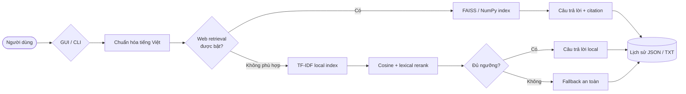

<div align="center">


# 🎓 HSU Chatbot

### Trợ lý tra cứu thông tin Đại học Hoa Sen — gọn nhẹ, minh bạch và chạy hoàn toàn bằng Python

[](https://github.com/alexmerex/Simple-ChatBot-HSU/actions/workflows/ci.yml)
[](https://www.python.org/)
[](https://scikit-learn.org/)
[](https://docs.astral.sh/ruff/)
[](#-kiểm-thử--chất-lượng-mã)

**[Tính năng](#-tính-năng-nổi-bật) · [Cài đặt](#-bắt-đầu-nhanh) · [Cấu hình](#%EF%B8%8F-cấu-hình) · [Kiến trúc](#-kiến-trúc) · [Đóng góp](#-đóng-góp)**

</div>

---

## 📌 Tổng quan

HSU Chatbot là ứng dụng hỏi đáp hướng tới việc giúp sinh viên và người quan tâm tra cứu nhanh thông tin về **Đại học Hoa Sen**. Dự án kết hợp kho tri thức cục bộ với dữ liệu website được giới hạn theo domain, hỗ trợ cả giao diện đồ họa lẫn dòng lệnh và luôn hiển thị nguồn khi câu trả lời đến từ web.

> [!IMPORTANT]
> Đây là chatbot **truy hồi thông tin** (extractive retrieval), không tự sáng tác câu trả lời như mô hình ngôn ngữ lớn. Kết quả phụ thuộc vào `knowledge.txt` và nội dung website đã lập chỉ mục.

## ✨ Tính năng nổi bật

| Nhóm | Khả năng |
| --- | --- |
| 🔎 Truy hồi local | TF-IDF n-gram, cosine similarity và lexical reranking |
| 🇻🇳 Tiếng Việt | Chuẩn hóa khoảng trắng, dấu câu và tìm kiếm không phân biệt dấu |
| 🌐 Nguồn web | Crawler whitelist domain, chia đoạn, lập chỉ mục FAISS hoặc NumPy |
| 🔗 Minh bạch | Hiển thị citation URL cho kết quả lấy từ website |
| 🧠 Cache thông minh | Tự kiểm tra SHA-256 của cấu hình và bỏ qua cache hỏng |
| ♻️ Hot reload | Tự nạp lại `knowledge.txt` khi nội dung thay đổi |
| 🖥️ Hai giao diện | GUI với Tkinter và CLI thân thiện với terminal |
| 🧾 Lịch sử | Xuất JSON/TXT, tự lưu khi thoát và dọn bản export cũ |
| 🧪 Chất lượng | Test tự động, Ruff lint/format và GitHub Actions CI |

## 🚀 Bắt đầu nhanh

### 1. Tải và tạo môi trường

```bash
git clone https://github.com/alexmerex/Simple-ChatBot-HSU.git
cd Simple-ChatBot-HSU
python -m venv .venv
```

<details>
<summary><strong>Kích hoạt môi trường trên Windows</strong></summary>

```powershell
.\.venv\Scripts\Activate.ps1
```

</details>

<details>
<summary><strong>Kích hoạt môi trường trên macOS/Linux</strong></summary>

```bash
source .venv/bin/activate
```

</details>

### 2. Cài dependency

```bash
pip install -r requirements.txt
```

FAISS là tùy chọn tăng tốc. Khi không có FAISS, ứng dụng tự chuyển sang NumPy:

```bash
pip install "faiss-cpu>=1.8,<2.0"
```

### 3. Tạo cấu hình

```powershell
Copy-Item .env.example .env
```

Trên macOS/Linux, dùng `cp .env.example .env`.

### 4. Chạy ứng dụng

```bash
# Giao diện dòng lệnh
python main.py --mode cli

# Giao diện Tkinter
python main.py --mode gui
```

## ⌨️ Lệnh CLI

| Lệnh | Chức năng |
| --- | --- |
| `/help` | Hiển thị danh sách lệnh |
| `/clear` | Xóa lịch sử của phiên hiện tại |
| `/reload` | Nạp lại tri thức local và web cache |
| `/reindex-web` | Crawl lại website và dựng mới web index |
| `/config` | Hiển thị cấu hình runtime đã được áp dụng |
| `/topk [n]` | Xem hoặc đổi số candidate giải thích |
| `/export json` | Xuất lịch sử dạng JSON |
| `/export txt` | Xuất lịch sử dạng văn bản |
| `exit` / `quit` | Thoát và tự lưu lịch sử |

## ⚙️ Cấu hình

Ứng dụng đọc biến môi trường từ `.env`. Crawler web mặc định **tắt** để khởi động nhanh và không phụ thuộc mạng.

<details open>
<summary><strong>Cấu hình cốt lõi</strong></summary>

| Biến | Mặc định | Mô tả |
| --- | --- | --- |
| `CHATBOT_MODE` | `gui` | Chế độ `gui` hoặc `cli` |
| `CHATBOT_KNOWLEDGE_FILE` | `knowledge.txt` | Kho tri thức local, mỗi dòng là một mục |
| `CHATBOT_RETRIEVAL_K` | `5` | Số ứng viên được truy hồi |
| `CHATBOT_EXPLANATION_TOP_K` | `3` | Số ứng viên hiển thị để giải thích |
| `CHATBOT_SIMILARITY_THRESHOLD` | `0.18` | Ngưỡng chấp nhận câu trả lời, từ `0` đến `1` |
| `CHATBOT_HOT_RELOAD` | `true` | Theo dõi thay đổi của kho tri thức |
| `CHATBOT_SHOW_EXPLANATIONS` | `true` | Hiển thị chi tiết điểm truy hồi |

</details>

### Định dạng kho tri thức local

Mỗi dòng trong `knowledge.txt` là một câu trả lời độc lập. Có thể gắn nguồn chính thức bằng
dấu phân cách ` || ` để chatbot hiển thị citation nhưng không đưa URL vào nội dung trả lời:

```text
Nội dung đã được kiểm chứng. || https://www.hoasen.edu.vn/trang-nguon/
```

Các dòng không có URL vẫn tương thích như trước. Khi chỉnh sửa file lúc ứng dụng đang chạy,
hot reload sẽ tự dựng lại local index.

<details>
<summary><strong>Cấu hình web retrieval</strong></summary>

| Biến | Mặc định | Mô tả |
| --- | --- | --- |
| `CHATBOT_WEB_ENABLED` | `false` | Bật/tắt truy hồi web |
| `CHATBOT_WEB_SEED_URLS` | `https://www.hoasen.edu.vn` | Danh sách URL bắt đầu, phân tách bằng dấu phẩy |
| `CHATBOT_WEB_ALLOWED_DOMAINS` | `hoasen.edu.vn` | Whitelist domain được phép crawl |
| `CHATBOT_WEB_MAX_PAGES` | `60` | Số trang HTML tối đa được lưu |
| `CHATBOT_WEB_TIMEOUT_SECONDS` | `12` | Timeout cho mỗi request |
| `CHATBOT_WEB_TOP_K` | `3` | Số web chunk được truy hồi |
| `CHATBOT_WEB_INDEX_DIR` | `web_index` | Thư mục cache index |

</details>

<details>
<summary><strong>Lịch sử và logging</strong></summary>

| Biến | Mặc định | Mô tả |
| --- | --- | --- |
| `CHATBOT_HISTORY_EXPORT_DIR` | `exports` | Thư mục lưu lịch sử |
| `CHATBOT_HISTORY_KEEP_LAST_EXPORTS` | `20` | Số bản export mới nhất được giữ lại |
| `CHATBOT_DEBUG` | `false` | Bật thông tin debug trong giao diện |
| `CHATBOT_LOG_LEVEL` | `INFO` | Cấp độ log của ứng dụng |

</details>

## 🏗 Kiến trúc



### Luồng web index

1. Chỉ nhận URL thuộc `CHATBOT_WEB_ALLOWED_DOMAINS` và giao thức HTTP(S).
2. Thu thập HTML tĩnh trong giới hạn trang, request và timeout.
3. Loại bỏ script/style, trích nội dung hữu ích rồi chia thành các chunk.
4. Vector hóa TF-IDF và dùng FAISS nếu có, nếu không dùng NumPy.
5. Lưu index kèm hash cấu hình; cache lỗi hoặc không còn phù hợp sẽ được dựng lại.

## 📁 Cấu trúc dự án

```text
Simple-ChatBot-HSU/
├── .github/workflows/ci.yml       # CI test và lint
├── docs/assets/                   # Hình ảnh README
├── src/chatbot_hsu/
│   ├── config.py                  # Cấu hình và validation
│   ├── engine.py                  # Local/web retrieval orchestration
│   ├── faiss_store.py             # Vector store FAISS/NumPy
│   ├── web_crawler.py             # Crawler giới hạn domain
│   ├── gui.py                     # Giao diện Tkinter
│   ├── history.py                 # Export và rotation lịch sử
│   ├── logging_utils.py
│   └── text_utils.py
├── tests/                         # Bộ test hồi quy
├── knowledge.txt                  # Kho tri thức local
├── main.py                        # Entry point
├── pyproject.toml
└── requirements.txt
```

## 🧪 Kiểm thử & chất lượng mã

Cài công cụ development:

```bash
pip install -r requirements-dev.txt
```

Chạy toàn bộ quality gates:

```bash
pytest
ruff check main.py src tests
ruff format --check main.py src tests
python -m compileall -q main.py src tests
```

## 🛡️ Nguyên tắc an toàn crawler

- Web retrieval là tính năng opt-in và không chạy mặc định.
- Chỉ chấp nhận HTTP(S) và hostname nằm trong whitelist.
- Domain giả dạng như `hoasen.edu.vn.evil.example` bị từ chối.
- Có timeout, giới hạn trang và giới hạn tổng request.
- Không chạy JavaScript và không thu thập nội dung ngoài HTML.
- Không lưu cookie, thông tin đăng nhập hay dữ liệu bí mật vào repository.

## 🗺️ Hướng phát triển

- [ ] Bổ sung dữ liệu theo nhóm tuyển sinh, học phí, học vụ và đời sống sinh viên.
- [ ] Thêm đánh giá retrieval bằng tập câu hỏi chuẩn hóa.
- [ ] Cải thiện chunking theo cấu trúc heading của trang.
- [ ] Thêm giao diện web nhẹ cho môi trường triển khai online.
- [ ] Thêm dashboard thống kê tỷ lệ fallback và nguồn truy hồi.

## 🤝 Đóng góp

Mọi issue và pull request đều được chào đón. Trước khi gửi thay đổi:

1. Tạo branch riêng từ `master`.
2. Bổ sung hoặc cập nhật test liên quan.
3. Chạy đầy đủ các quality gates ở trên.
4. Mô tả rõ vấn đề, cách sửa và kết quả kiểm chứng trong pull request.

---

<div align="center">

Được xây dựng với ❤️ và Python cho cộng đồng sinh viên Đại học Hoa Sen.

Nếu dự án hữu ích, hãy để lại một ⭐ để ủng hộ!

</div>
